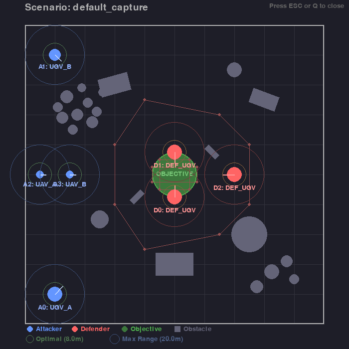

# Mission Gym

A game-like reinforcement learning environment for commanding a fleet of attackers to capture an objective zone while scripted defenders try to tag/disable units.


## Features

- **Multi-unit control**: Centralized single-policy control over multiple attacker units
- **MultiDiscrete action space**: Per-unit atomic commands (THROTTLE, TURN, TAG, etc.)
- **Rich observations**: Bird's-eye-view raster + vector features
- **Configurable scenarios**: YAML-based configuration for world, units, sensors, engagement, rewards
- **Scripted defenders**: AI-controlled defenders with patrol and pursuit behaviors
- **Training monitoring**: HTML dashboard with real-time stats and simulation snapshots
- **Backend abstraction**: Pluggable physics backends (Simple2.5D, Isaac Sim stub, MuJoCo stub)



*Scenario viewer showing attackers (blue), defenders (red), objective zone (green), obstacles, and range circles*

---

## Installation

### From Source (Recommended)

```bash
git clone <repo-url>
cd comander
pip install -e .
```

### Dependencies Only

```bash
pip install gymnasium numpy pyyaml stable-baselines3 torch pygame shapely tensorboard imageio imageio-ffmpeg
```

### Development Installation

```bash
pip install -e ".[dev]"
```

---

## Quick Start

### 1. Smoke Test

Verify the environment works correctly:

```bash
python -m mission_gym.scripts.smoke_test
```

### 2. View Scenario

Visualize the current scenario configuration:

```bash
python -m mission_gym.scripts.view_scenario
```

This shows a Pygame window with:
- Unit spawn positions and headings
- Obstacles and forest areas
- Objective zone
- Defender patrol waypoints
- Range circles (max/optimal tag range)

### 3. Manual Play

Play the game manually with keyboard controls:

```bash
python -m mission_gym.scripts.play_manual
```

**Controls:**
| Key | Action |
|-----|--------|
| `1-4` | Select attacker unit |
| `W/S` | Throttle up/down |
| `A/D` | Turn left/right |
| `SPACE` | Brake |
| `H` | Hold position |
| `T` | Tag (attempt to disable nearby defender) |
| `E` | Scan |
| `R/F` | Altitude up/down (UAV only) |
| `ESC` | Quit |

---

## Training

### Basic Training

```bash
python -m mission_gym.scripts.train_ppo --timesteps 500000
```

This creates:
1. **HTML Dashboard** (`training_dashboard.html`) - Auto-refreshes every 30s
2. **TensorBoard logs** (`./logs/`) - For detailed metrics
3. **Checkpoints** (`./logs/checkpoints/`) - Periodic model saves

### Training with Options

```bash
python -m mission_gym.scripts.train_ppo \
  --timesteps 500000 \
  --n-envs 8 \
  --eval-freq 10000 \
  --html-dashboard my_dashboard.html \
  --save-path my_model \
  --log-dir ./my_logs
```

| Option | Description | Default |
|--------|-------------|---------|
| `--timesteps` | Total training steps | 100000 |
| `--n-envs` | Parallel environments | 4 |
| `--eval-freq` | Evaluation frequency | 10000 |
| `--html-dashboard` | Dashboard HTML path | training_dashboard.html |
| `--save-path` | Model save path | ppo_mission_gym |
| `--log-dir` | TensorBoard log directory | ./logs |

---

## Monitoring

### Option 1: HTML Dashboard (Recommended)

The HTML dashboard is automatically generated during training:

```bash
# Open training_dashboard.html in your browser
# It auto-refreshes every 30 seconds
```

**Dashboard features:**
- 📊 Real-time stats: timesteps, episodes, FPS
- 📈 Reward curves with interactive Chart.js charts
- 📋 Recent episode table with status icons
- 🎬 Simulation snapshots from evaluations
- ⚙️ Configuration viewer (all YAML files in tabs)

### Option 2: TensorBoard

```bash
tensorboard --logdir ./logs
# Open http://localhost:6006
```

**TensorBoard features:**
- Detailed training curves
- Policy loss, value loss, entropy
- Hyperparameter tracking

---

## Visualization

### Live Training (Pygame Window)

Watch the simulation during training:

```bash
python -m mission_gym.scripts.live_training --timesteps 100000 --render-freq 50
```

### Record Episodes (GIF/MP4)

```bash
# Random agent
python -m mission_gym.scripts.record_video --episodes 3 --format gif

# Trained agent
python -m mission_gym.scripts.record_video --model ppo_mission_gym --episodes 3 --format mp4
```

### Evaluate Trained Model

```bash
python -m mission_gym.scripts.evaluate --model ppo_mission_gym --episodes 10
```

---

## Environment Details

### Observation Space

The environment provides a `Dict` observation:

| Key | Shape | Description |
|-----|-------|-------------|
| `bev` | `(128, 128, 8)` | Bird's-eye-view raster image |
| `vector` | `(N,)` | Flattened unit features + global state |

**BEV Channels:**
| Channel | Content |
|---------|---------|
| 0 | Obstacles |
| 1 | Objective zone |
| 2 | All attackers |
| 3 | All defenders |
| 4 | Attacker type ID map |
| 5 | Defender FOV/detection |
| 6 | Tag cooldown heatmap |
| 7 | Capture progress (broadcast) |

### Action Space

`MultiDiscrete` with one discrete action per attacker unit.

**UGV Actions (9):**
`NOOP`, `THROTTLE_UP`, `THROTTLE_DOWN`, `TURN_LEFT`, `TURN_RIGHT`, `BRAKE`, `HOLD`, `TAG`, `SCAN`

**UAV Actions (10):**
`NOOP`, `THROTTLE_UP`, `THROTTLE_DOWN`, `YAW_LEFT`, `YAW_RIGHT`, `ALT_UP`, `ALT_DOWN`, `HOLD`, `TAG`, `SCAN`

---

## Configuration

All parameters are configurable via YAML files in `configs/`:

| File | Description |
|------|-------------|
| `world.yaml` | Arena size, obstacles, physics settings |
| `scenario.yaml` | Unit spawns, objective zone |
| `units_attackers.yaml` | Attacker unit type definitions |
| `units_defenders.yaml` | Defender unit type definitions |
| `sensors.yaml` | Lidar, radar, camera configs |
| `engagement.yaml` | Tag beam parameters, cooldowns |
| `reward.yaml` | Reward function weights |

### Example: Add a New Obstacle

Edit `configs/world.yaml`:

```yaml
obstacles:
  - type: "circle"
    position: [50.0, 50.0]
    radius: 10.0
  - type: "rectangle"
    position: [100.0, 100.0]
    size: [20.0, 10.0]
    angle: 45.0
```

### Example: Modify Unit Properties

Edit `configs/units_attackers.yaml`:

```yaml
UGV_A:
  type: "UGV"
  radius: 2.5          # Footprint size (affects obstacle navigation)
  max_speed: 8.0       # m/s
  max_acceleration: 3.0
  max_turn_rate: 90.0  # deg/s
  initial_integrity: 100.0
```

---

## Project Structure

```
comander/
├── pyproject.toml          # Package configuration
├── README.md               # This file
├── configs/                # YAML configuration files
│   ├── world.yaml
│   ├── scenario.yaml
│   ├── units_attackers.yaml
│   ├── units_defenders.yaml
│   ├── sensors.yaml
│   ├── engagement.yaml
│   └── reward.yaml
├── tests/                  # Pytest test suite
│   ├── test_env.py
│   ├── test_config.py
│   └── test_dynamics.py
└── mission_gym/            # Main package
    ├── __init__.py
    ├── env.py              # Gymnasium environment
    ├── config.py           # Configuration loading
    ├── scenario.py         # Scenario management
    ├── dynamics.py         # Unit physics/kinematics
    ├── sensors.py          # Sensor simulation
    ├── engagement.py       # Tag mechanics
    ├── reward.py           # Reward function
    ├── renderer.py         # Pygame rendering
    ├── defenders.py        # Scripted defender AI
    ├── backends/           # Physics backend abstraction
    │   ├── base.py
    │   ├── simple2p5d.py
    │   ├── isaac_stub.py
    │   └── mujoco_stub.py
    └── scripts/            # Runnable scripts
        ├── smoke_test.py
        ├── play_manual.py
        ├── train_ppo.py
        ├── evaluate.py
        ├── monitoring.py
        ├── live_training.py
        ├── record_video.py
        └── view_scenario.py
```

---

## Testing

### Run All Tests

```bash
pytest tests/ -v
```

### Run with Coverage

```bash
pytest tests/ --cov=mission_gym --cov-report=html
```

---

## CI/CD

This project uses GitHub Actions for continuous integration. On every push/PR:

1. ✅ Linting with flake8
2. ✅ Type checking with mypy (optional)
3. ✅ Unit tests with pytest
4. ✅ Smoke test verification

See `.github/workflows/ci.yml` for details.

---

## License

MIT
